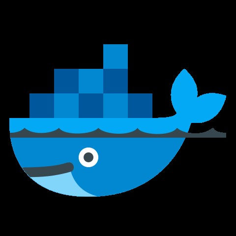

# Docker


Basically, consists in `Images` and `Containers`.

`Image` -> equivalent to `ISO`.

`Container` -> equivalent to a running `VM`.

In other words...
Container is a `instance` of a `image`!
---
<!-- end_slide -->
Interacting with images.
---
<!-- end_slide -->
# docker run

```bash
docker run ubuntu
```
<!-- pause -->
```bash
docker run [image_name]
```
<!-- pause -->
```bash
Unable to find image 'ubuntu:latest' locally
latest: Pulling from library/ubuntu
29202e855b20: Pull complete
Digest: sha256:e6173d4dc55e76b87c4af8db8821b1feae4146dd47341e4d431118c7dd060a74
Status: Downloaded newer image for ubuntu:latest
```
<!-- pause -->
In interactive mode...
```bash
docker run -ti ubuntu
```
<!-- end_slide -->
# docker ps

In another terminal...

```bash
docker ps
```
<!-- pause -->
```bash
CONTAINER ID   IMAGE     COMMAND       CREATED          STATUS          PORTS     NAMES
b8f9ea7c752b   ubuntu    "/bin/bash"   36 seconds ago   Up 35 seconds             amazing_taussig
```

<!-- end_slide -->
# docker run

[Image] -> run -> [Container]

Every `docker run` creates a new `container`.
---
<!-- end_slide -->
Interacting with containers.
---
<!-- end_slide -->

# docker start

Once a container is already created, we can start it again.

```bash
docker start amazing_taussig
```
<!-- pause -->
```bash
docker start [container_name]
```
<!-- pause -->
```bash
docker stop amazing_taussig
```

All data changed inside the container is kept.
---

<!-- end_slide -->
# docker rm
```bash
docker rm amazing_taussig
```

If you destroy the container, all data is lost. You need to create a new container using `docker run`.
---

Remember
---

- Container is a instance of a image.
- You can create a container using `docker run`.
- You can have `multiple containers` from the `same image`.
- Each container will have its own `state` (filesystem).
<!-- end_slide -->
# Ports

Expose a service from the container to the host.

```bash
docker run -p 8080:80 nginx
```


<!-- end_slide -->
# Dockerfile

Is a template file that describes the image.

```dockerfile
```
