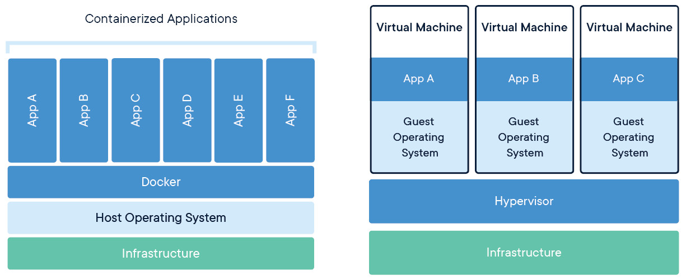

---
# try also 'default' to start simple
theme: eloc
# random image from a curated Unsplash collection by Anthony
# like them? see https://unsplash.com/collections/94734566/slidev
# background: https://source.unsplash.com/collection/94734566/1920x1080
# apply any unocss classes to the current slide
class: 'text-center'
# https://sli.dev/custom/highlighters.html
# highlighter: shiki
# some information about the slides, markdown enabled
info: |
  ## Slidev Starter Template
  Presentation slides for developers.

  Learn more at [Sli.dev](https://sli.dev)

fonts:
  # basically the text
  sans: Noto Sans Mono
  # use with `font-serif` css class from UnoCSS
  serif: Noto Sans Mono
  # for code blocks, inline code, etc.
  mono: Fira Code

---

<style>
  h1 {
    font-size: 4em;
  }
  p {
    font-size: 3rem !important;

  }
  </style>

# Welcome to Slidev

Presentation slides for developers

---

# Docker
<!--  -->

---

Basically, consists in `Images` and `Containers`.

`Image` -> equivalent to `ISO`.

`Container` -> equivalent to a running `VM`.

In other words...
Container is a `instance` of a `image`!


---

<!-- 
> https://www.docker.com/wp-content/uploads/2021/11/docker-containerized-and-vm-transparent-bg.png -->


---

# Interacting with images.

---

# docker run

```bash
docker run ubuntu
```


```bash
docker run [image_name]
```


```bash
Unable to find image 'ubuntu:latest' locally
latest: Pulling from library/ubuntu
29202e855b20: Pull complete
Digest: sha256:e6173d4dc55e76b87c4af8db8821b1feae4146dd47341e4d431118c7dd060a74
Status: Downloaded newer image for ubuntu:latest
```


In interactive mode...
```bash +exec
docker run -ti ubuntu
```


---

# docker ps

In another terminal...

```bash +exec
docker ps
```


```bash
CONTAINER ID   IMAGE     COMMAND       CREATED          STATUS          PORTS     NAMES
b8f9ea7c752b   ubuntu    "/bin/bash"   36 seconds ago   Up 35 seconds             amazing_taussig
```


---

# docker run

[Image] -> run -> [Container]

Every `docker run` creates a new `container`.

---

# Interacting with containers.


---

# docker start

Once a container is already created, we can start it again.

```bash
docker start amazing_taussig
```


```bash
docker start [container_name]
```


```bash
docker stop amazing_taussig
```

All data changed inside the container is kept.

---

# docker rm
```bash
docker rm amazing_taussig
```


If you destroy the container, all data is lost. You need to create a new container using `docker run`.


Remember

- Container is a instance of a image.


- You can create a container using `docker run`.


- You can have `multiple containers` from the `same image`.


- Each container will have its own `state` (filesystem).


---

# Dockerfile

It is a template file that describes the image.

```bash
FROM ubuntu
RUN apt-get update && apt-get install -y cowsay fortune
COPY icons8-docker-240.jpg /home/
```


```bash
docker build .
```


```bash
docker images
```


```bash
docker build -t my-ubuntu .
```


---

# Dockerfile
```bash
docker run -ti my-ubuntu bash
```


```bash
docker run -ti my-ubuntu [cmd]
```


---

# Volumes

Persist data between containers and host system.

```bash
docker run -v /host/path:/container/path ubuntu
```


```bash
docker run -v [host_folder]:[container_folder] ubuntu
```


Remember


- Any data put on `/host/path` will be shared to `/container/path` and `vice-versa`.


- It can have `multiple volumes` in the same container.


- The sharing is made in `real time`. Any change is reflected in both sides.


- The file is `not copied`. It is `shared` between the host and the container.


- Similar of `sharing a folder` in same network.


---

# Ports

Expose a service from the container to the host.

```bash
FROM oven/bun
WORKDIR /home
COPY server.ts /home
ARG NODE_ENV
CMD [ "bun", "server.ts" ]
```


```bash
docker build -t server .
```


```bash
docker run -ti --rm --name my-server server
```


Missing port exposed to host system.

```bash
docker run -ti -p 5500:3000 --rm --name my-server server
```


---

Docker Compose


---

# docker compose
Agregatte multiple containers configuration in a single file.

```yaml
version: "3.4"
services:
  server:
    build:
      context: ../my-server/
      dockerfile: Dockerfile
      args:
        - NODE_ENV=development
    environment:
      - PORT=3300
    volumes:
      - ./:/home/mounted-volume
    ports:
      - 5500:3300
```


---

# docker compose
```bash
docker compose up

docker compose build

docker compose up --build

docker compose down

docker compose ps
```


---

End 🐳

---
